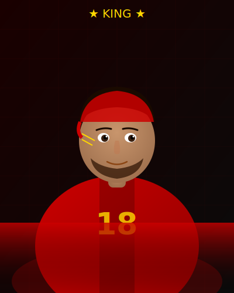

# 🔴⚫ RCB Fan Page — EE SALA CUP NAMDE 🏆

> **IPL 2025 Champions — Royal Challengers Bangalore**
> The most epic RCB fan page with 3D motion graphics, Three.js animations, and custom SVG player illustrations.

---

## 🚀 HOW TO DEPLOY ON GITHUB PAGES (Step by Step)

### STEP 1 — Create a GitHub Account
1. Go to **https://github.com**
2. Click **"Sign Up"**
3. Enter your email, create a password, and pick a username
4. Verify your email address

---

### STEP 2 — Create a New Repository
1. After logging in, click the **"+" icon** at the top-right corner
2. Select **"New repository"**
3. Fill in the details:
   - **Repository name:** `rcb-fan-page` (or any name you like)
   - **Description:** `RCB Fan Page - Ee Sala Cup Namde 2025`
   - Set to **Public** ✅ (required for free GitHub Pages)
   - ✅ Check **"Add a README file"**
4. Click **"Create repository"**

---

### STEP 3 — Upload Your Files
1. Inside your new repository, click **"Add file"** → **"Upload files"**
2. Upload ALL these files/folders from the ZIP:
   ```
   index.html          ← Upload this
   css/
     style.css         ← Upload this
   js/
     main.js           ← Upload this
   images/
     virat.svg         ← Upload this
     faf.svg           ← Upload this
     maxwell.svg       ← Upload this
     siraj.svg         ← Upload this
     dk.svg            ← Upload this
     chahal.svg        ← Upload this
   ```
   
   > ⚠️ IMPORTANT: Keep the folder structure! Upload `css/style.css` inside a `css` folder, `js/main.js` inside a `js` folder, and all SVGs inside an `images` folder.

3. Scroll down and click **"Commit changes"** → **"Commit directly to the main branch"**

---

### STEP 4 — Enable GitHub Pages
1. Go to your repository's **"Settings"** tab (top menu)
2. In the left sidebar, scroll down to **"Pages"**
3. Under **"Source"**, click the dropdown and select **"Deploy from a branch"**
4. Under **"Branch"**, select **"main"** and **"/ (root)"**
5. Click **"Save"**

---

### STEP 5 — Your Site is LIVE! 🎉
- Wait **2-3 minutes** for GitHub to build your site
- Your site will be live at:
  ```
  https://YOUR-USERNAME.github.io/rcb-fan-page/
  ```
- Refresh the Settings → Pages page to see the link appear!

---

## 📁 File Structure

```
rcb-fan-page/
├── index.html          — Main HTML page
├── css/
│   └── style.css       — All styles, animations, layouts
├── js/
│   └── main.js         — Three.js 3D scene, GSAP, counters, cursor
├── images/
│   ├── virat.svg       — Virat Kohli custom illustration
│   ├── faf.svg         — Faf du Plessis illustration
│   ├── maxwell.svg     — Glenn Maxwell illustration
│   ├── siraj.svg       — Mohammed Siraj illustration
│   ├── dk.svg          — Dinesh Karthik illustration
│   └── chahal.svg      — Yuzvendra Chahal illustration
└── README.md           — This guide
```

---

## ✨ Features

- 🌌 **Three.js 3D Scene** — 2000 floating ember particles in red & gold
- ⭕ **3D Rotating Rings** — CSS + Three.js torus rings with perspective
- 🖱️ **Custom Gold Cursor** — Smooth cursor with hover effects
- 🎬 **Cinematic Loader** — Loading screen before the page opens
- ⚡ **Hero Stagger Animation** — Each element flies in one by one
- 🏏 **Custom SVG Player Art** — Hand-crafted illustrations of all players
- 📜 **Complete Timeline** — 2008 to June 3, 2025 championship
- 🔢 **Animated Counters** — Stats count up on scroll
- 🌊 **Scroll Reveal** — Elements animate into view as you scroll
- 📣 **"Ee Sala Cup Namde"** — Glowing championship chant section
- 📱 **Mobile Responsive** — Works on all screen sizes

---

## 💡 Customization Tips

### Change Player Names / Stats
Open `index.html` and search for player names to update.

### Change Colors
Open `css/style.css` and edit the `:root` variables at the top:
```css
:root {
  --red: #CC0000;     /* RCB Red */
  --gold: #FFD700;    /* Gold */
  --black: #060608;   /* Background */
}
```

### Add Your Own Photo
Replace any SVG in the `/images/` folder with a JPG/PNG of the same name:
```html
<!-- In index.html, change: -->

<!-- To your own photo: -->

```

---

## 🆘 Troubleshooting

| Problem | Solution |
|---------|----------|
| Images not showing | Make sure `images/` folder is uploaded with all 6 SVG files |
| Styles not loading | Make sure `css/style.css` is in a `css/` folder |
| 3D not working | Check internet connection (Three.js loads from CDN) |
| GitHub Pages not live | Wait 5 minutes, check Settings → Pages for the URL |

---

## 🔴 EE SALA CUP NAMDE — FOREVER 🏆

*Made with ❤️ by a true RCB fan. Not affiliated with BCCI, IPL or Royal Challengers Bangalore.*
